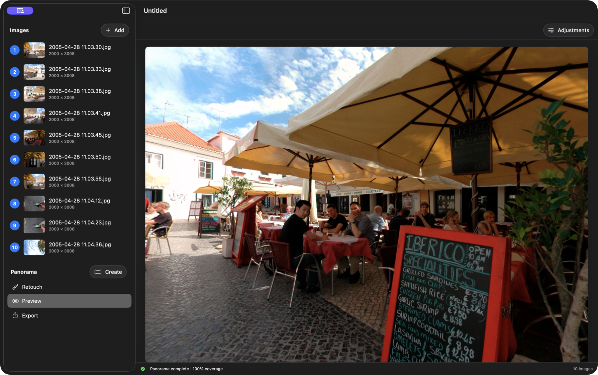
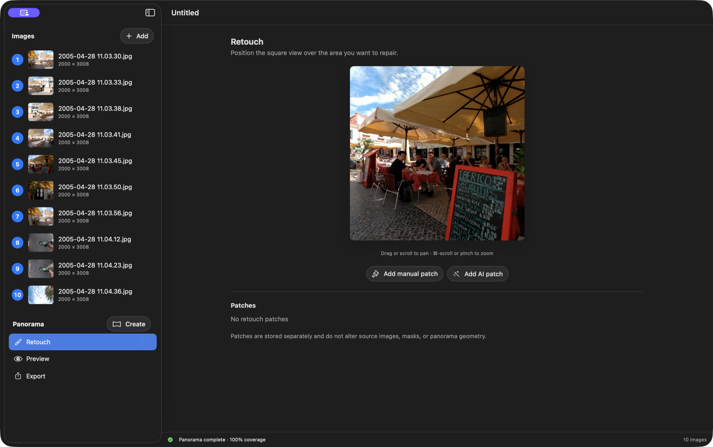
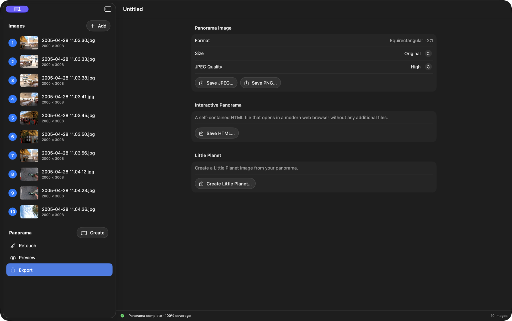

# PanoWizard 101 — From source images to a finished panorama

PanoWizard turns one horizontal ring of overlapping fisheye photos into a complete 360° × 180° equirectangular panorama. This short guide follows one real image sequence through the normal workflow.

## 1. Add the source images

Create a new panorama, then click **Add** and select the full image sequence. The photographs should cover one complete turn around the camera with enough overlap between neighboring images.

Select any image in the sidebar to inspect it. Most sequences can be stitched as they are. When necessary, the **Exclude** and **Include** brushes let you tell PanoWizard which source-image areas to avoid or prefer.

## 2. Create the panorama

Click **Create** beside **Panorama**. PanoWizard detects image features, matches the overlaps, calculates the panorama geometry, and blends the original pixels. This can take a few minutes for a full-resolution sequence.

## 3. Inspect the result

PanoWizard opens **Preview** when stitching is complete. Move around the panorama and inspect the horizon, seams, moving subjects, and the top and bottom of the sphere. The status line confirms the coverage of the finished panorama.

Use **Adjustments** for final global image corrections when needed.

## 4. Correct only what needs correction

If a stitching seam uses the wrong source pixels, return to that source image, paint a small **Exclude** or **Include** mask, and create the panorama again.

For a localized blemish in an otherwise good panorama, open **Retouch**, position the square view over the area, and add a manual or AI patch. Patches are stored separately and do not change the source images or panorama geometry.

## 5. Export the finished panorama

Open **Export** and choose the result you need:

- **Save JPEG…** for a compact finished image.
- **Save PNG…** for a lossless panorama.
- **Save HTML…** for a self-contained interactive 360° viewer.

Keep **Size: Original** when you want the full stitched resolution. The standard image export is equirectangular at a 2:1 aspect ratio.

That is the complete basic workflow: **add → create → inspect → correct if needed → export**.

As a bonus, **Create Little Planet…** turns the same finished panorama into a square Little Planet projection.

## How Do I?

- [Mask source images](HowTo/Masking/README.md) — exclude unwanted pixels and prioritize the best overlapping content.
- [Create a Little Planet](HowTo/LittlePlanet/README.md) — turn the finished panorama into a square Little Planet image.
