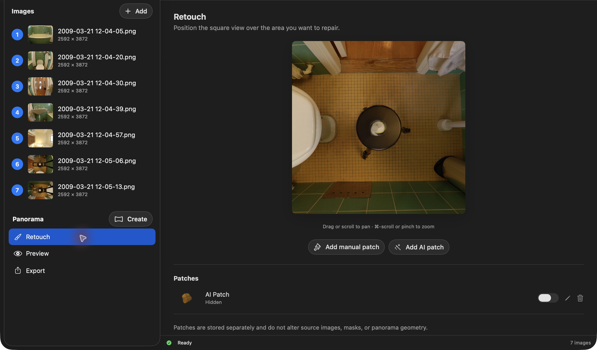
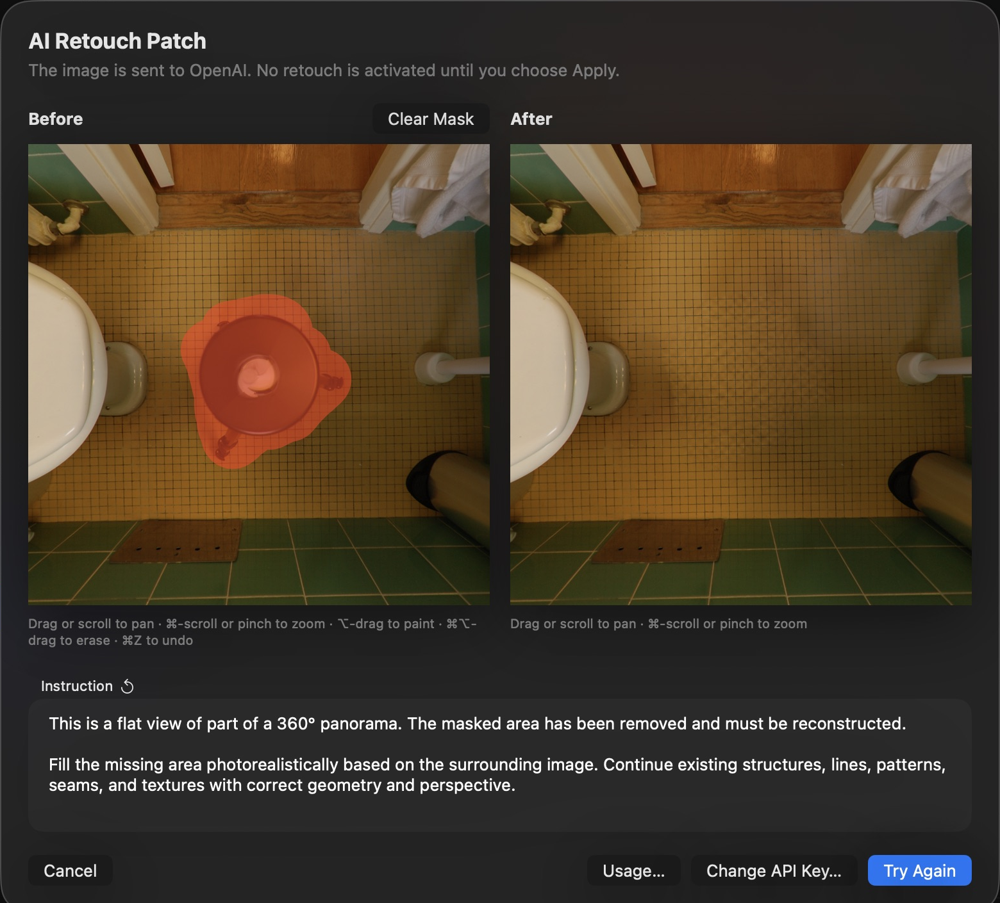
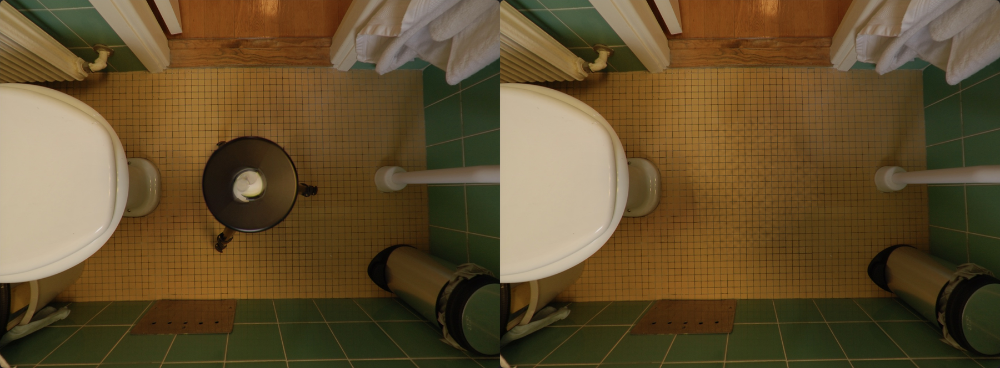

# How Do I Create an AI Patch?

An AI patch repairs a small area of an otherwise finished panorama. The selected image and instruction are sent to OpenAI. Nothing is activated until you choose **Apply**.

## Before you start

AI retouch requires internet access and your own OpenAI API key. API usage is billed separately by OpenAI; it is not included in a ChatGPT or Codex subscription.

Use **Create API Key…** in the patch dialog to open setup, then **Open OpenAI API Keys…** to obtain a key, or paste one you already have. **Change API Key…** replaces it. **Usage…** opens the usage dashboard. For data handling, see [Privacy Policy](../../privacy.html).

## Choose the area

Open **Retouch**, frame the problem in the square view, and click **Add AI patch**. Drag or scroll to pan; Command-scroll or pinch to zoom.

The dialog contains a fixed capture. Its pan/zoom controls inspect that image; cancel and reposition in Retouch to capture a different area.

## Mask and generate

In **Before**, **Option-drag** over the problem. **Command-Option-drag** erases; **Command-Z** undoes a stroke. **Clear Mask** removes the mask. Transparent gaps are selected automatically in a new patch.

Keep the supplied **Instruction** unless you need to add a specific requirement. Click **AI Retouch**. A mask and a nonempty instruction are required; generation may take a while and can be cancelled.

## Review and apply

Inspect lines, textures, color, and the repair boundary in **After**. AI can invent plausible but incorrect details. Choose **Try Again** for another attempt, or **Apply** to keep the result.

*Left: original. Right: the saved repair enabled. An AI repair is generated content, not recovered source pixels.*

In **Patches**, use the switch to hide/show a repair, click its thumbnail to locate it, or use the pencil/trash button to edit/delete it. Finish source corrections first: changing sources or masks clears patches. Save the project to keep an accepted repair.

[Back to PanoWizard Help](../../index.html)
