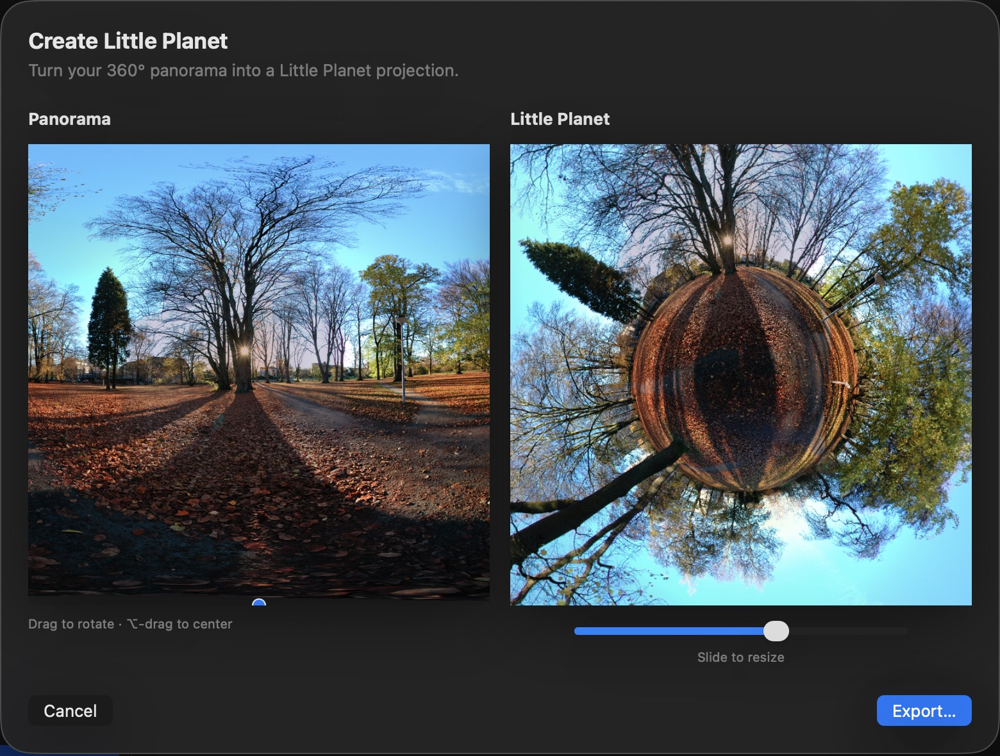
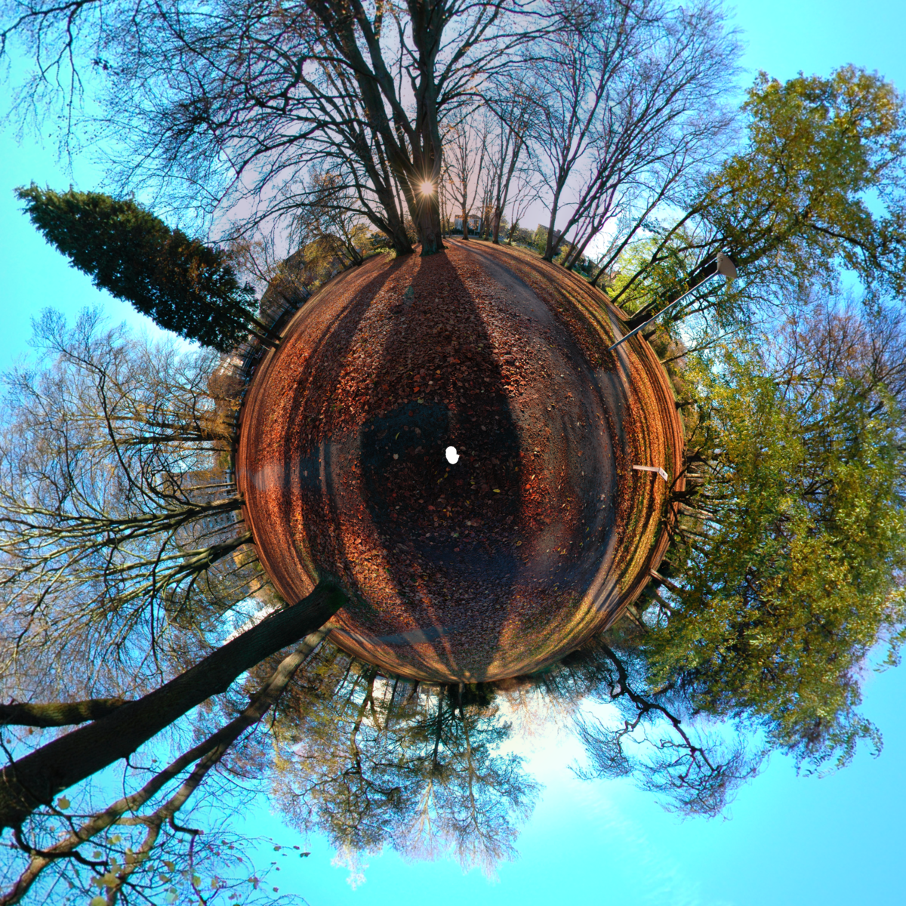

# Create a Little Planet

A Little Planet turns the full 360° panorama into a square stereographic projection.

## Open Little Planet

Finish the panorama, open **Export**, and click **Create Little Planet…**.

## Shape the planet

Use the panorama on the left:

- **Drag horizontally or scroll horizontally** to rotate the planet.
- **Option-drag** to position the center.
- Use the slider **below the Little Planet preview** to make the planet smaller or larger.

The right preview shows the result. The slider changes composition, not image resolution.

## Export the image

Click **Export…** and save the PNG. The default filename is `little-planet.png`. A new 4096 × 2048 panorama produces a **2048 × 2048** planet image.

[Back to PanoWizard Help](../../index.html)
