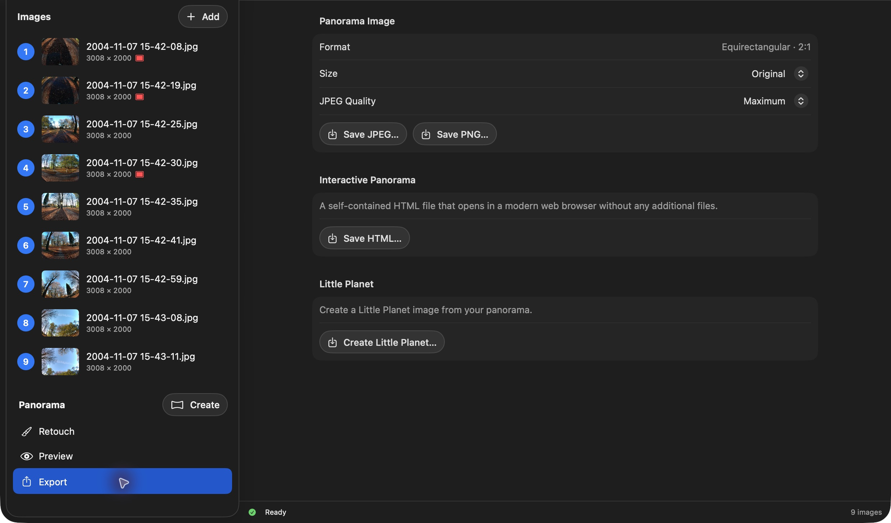

# How Do I Create a Little Planet?

A Little Planet turns the full 360° panorama into a square stereographic projection.

## Open Little Planet

Finish the panorama, open **Export**, and click **Create Little Planet…**.

## Shape the planet

Use the panorama on the left to choose the composition:

- **Drag horizontally or scroll horizontally** to rotate the planet.
- **Option-drag** to position the planet's center.
- **Slide** to make the planet smaller or larger.

The square preview on the right shows the rendered result.

*This screenshot shows an earlier layout. In the current app, use Option-drag to set the center; the size slider is below the Little Planet preview.*

## Export the image

Click **Export…**, choose a location, and save the PNG. The default filename is `little-planet.png`.

[Back to PanoWizard Help](../../index.html)
