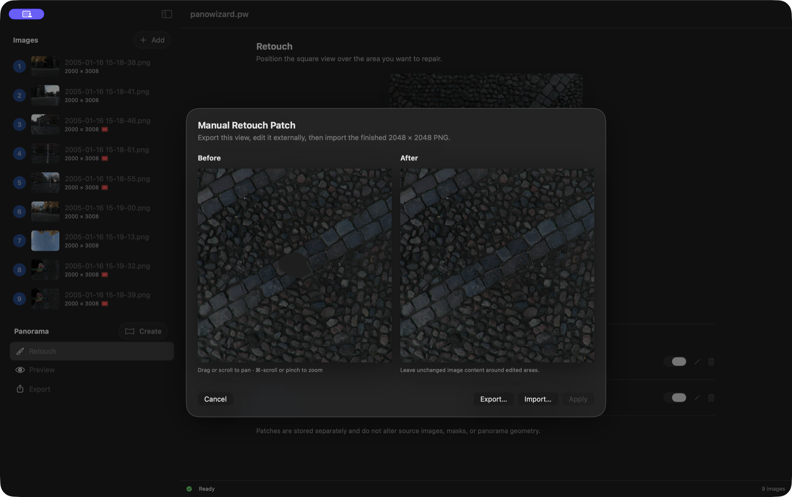
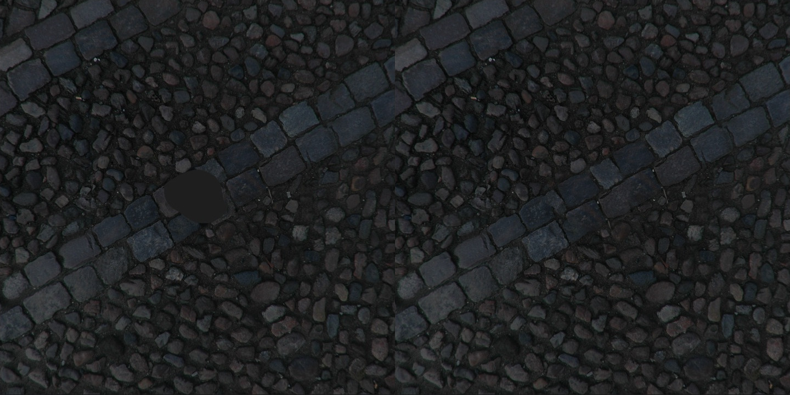
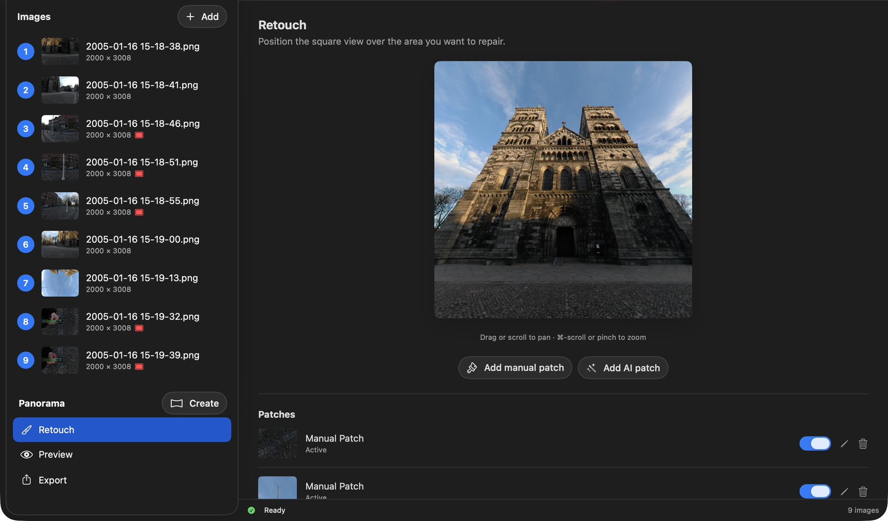

# Create a manual patch

A manual patch repairs a small area of an otherwise finished panorama using an external image editor. It does not alter the source photographs or panorama geometry.

## Choose the area

Open **Retouch**, position the square view over the problem, and click **Add manual patch**. Drag or scroll to pan; Command-scroll or pinch to zoom.

This captures a fixed view. Inside the patch dialog, pan and zoom inspect that capture; to choose a different panorama area, cancel and reposition in Retouch.

## Export and edit

Click **Export…** to save a **2048 × 2048 PNG**. Open it in your image editor and repair the problem. **Do not resize or crop it.** Leave unchanged image content around the repair for blending.

## Import and apply

Return to PanoWizard, click **Import…**, and select the edited PNG. Compare **Before** and **After**, then click **Apply**.

*Left: before the patch. Right: the manual repair.*

The patch appears in **Patches**. Click its thumbnail to locate it in Preview, use the switch to hide/show it, or choose its pencil/trash button to edit/delete it. Newer patches appear over older ones where they overlap.

Finish source corrections first: changing sources or masks clears retouch patches. Save the project to keep the repair.

[Back to PanoWizard Help](../../index.html)
