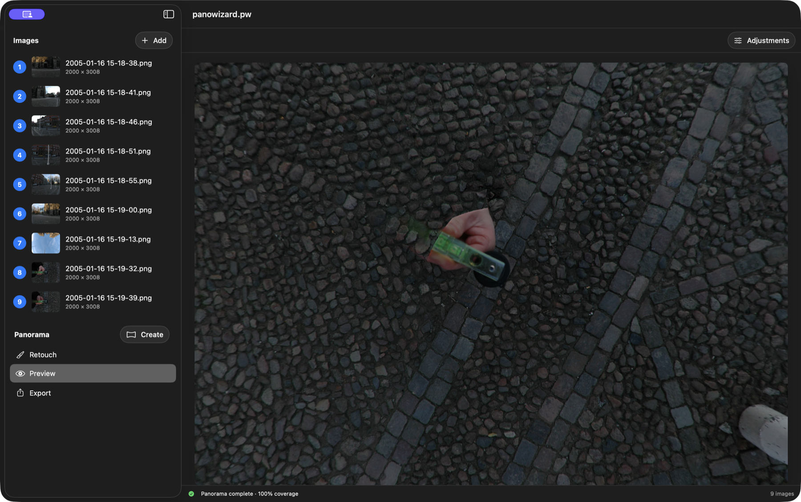
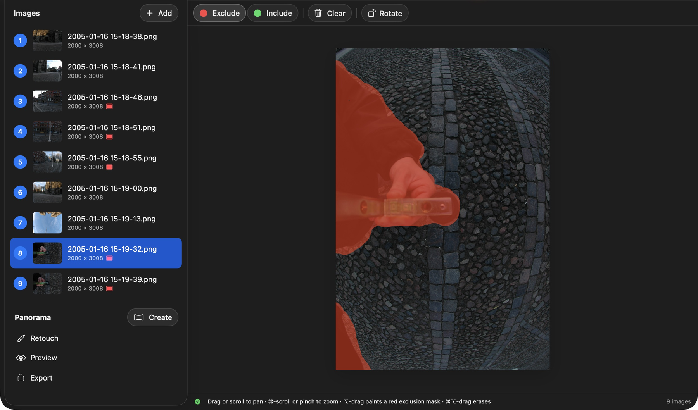
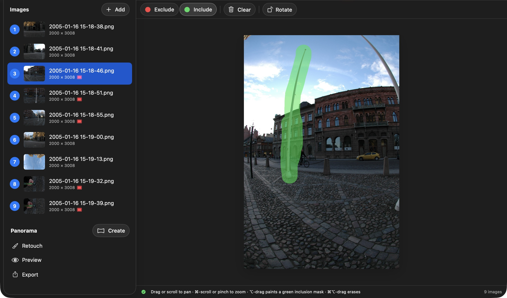
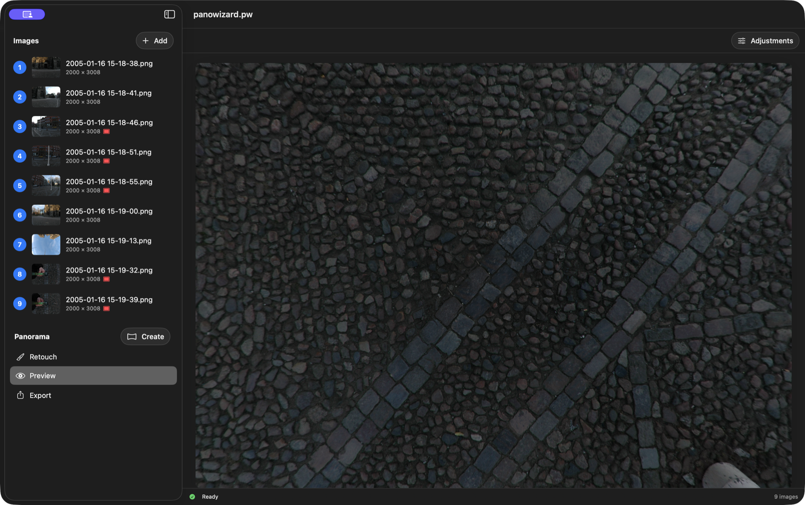

# How To: Mask source images

Masks help when an automatic seam selects the wrong content from overlapping source images. This example starts with the photographer's hand and level visible at the bottom of the panorama.

## Exclude unwanted content

Select the source image that contains the problem, choose **Exclude**, then Option-drag over only the unwanted area.

**Red / Exclude:** PanoWizard must not use these pixels.

## Prefer the best overlap

When another source has the content you want, select it, choose **Include**, and Option-drag over that area.

**Green / Include:** PanoWizard prioritizes these pixels when choosing which overlapping image content to use.

## Rebuild and inspect

**Recreating the panorama clears existing retouch results.** Make source-mask corrections before adding retouch patches when possible.

Click **Create** again, then inspect the same place in **Preview**. Here the unwanted hand and level are gone and the cobblestones continue across the nadir.

Keep masks as small as practical. If an Exclude mask leaves a black or uncovered area, reduce it so PanoWizard still has valid source pixels to use. Command-Option-drag erases a mask.

[Back to PanoWizard Help](../../index.html)
