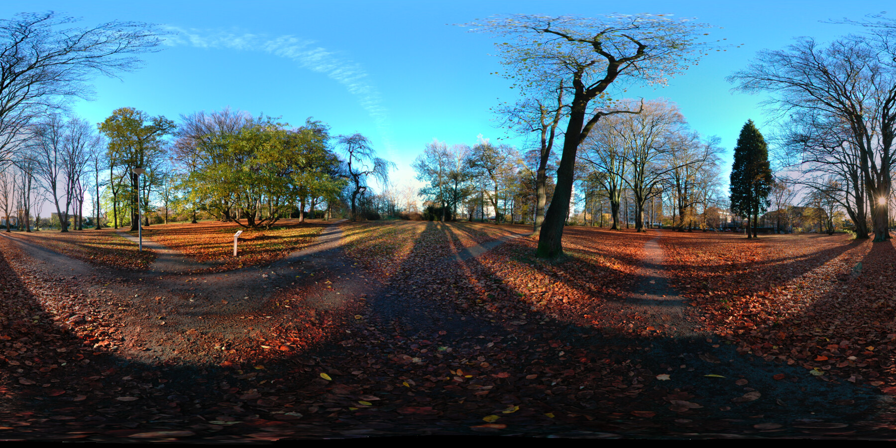
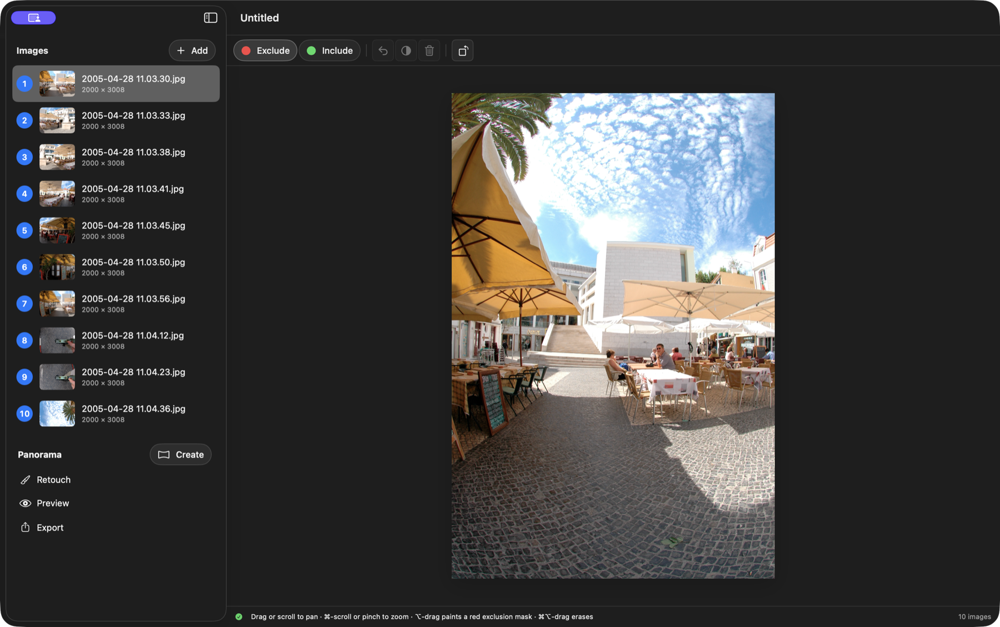
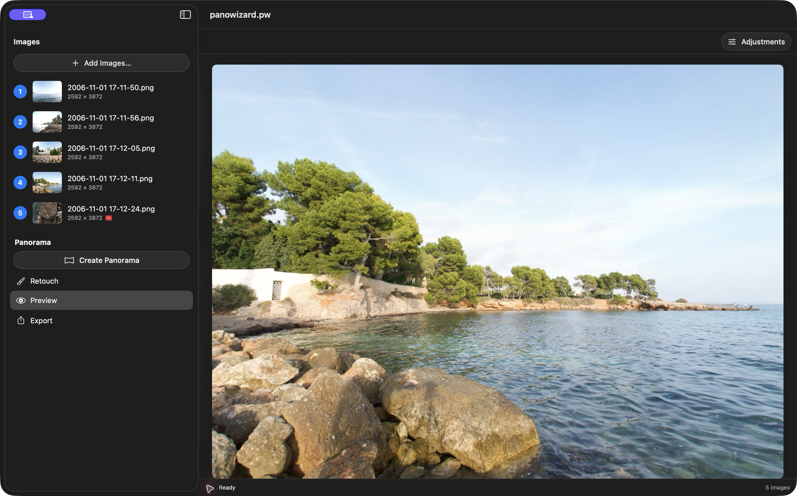
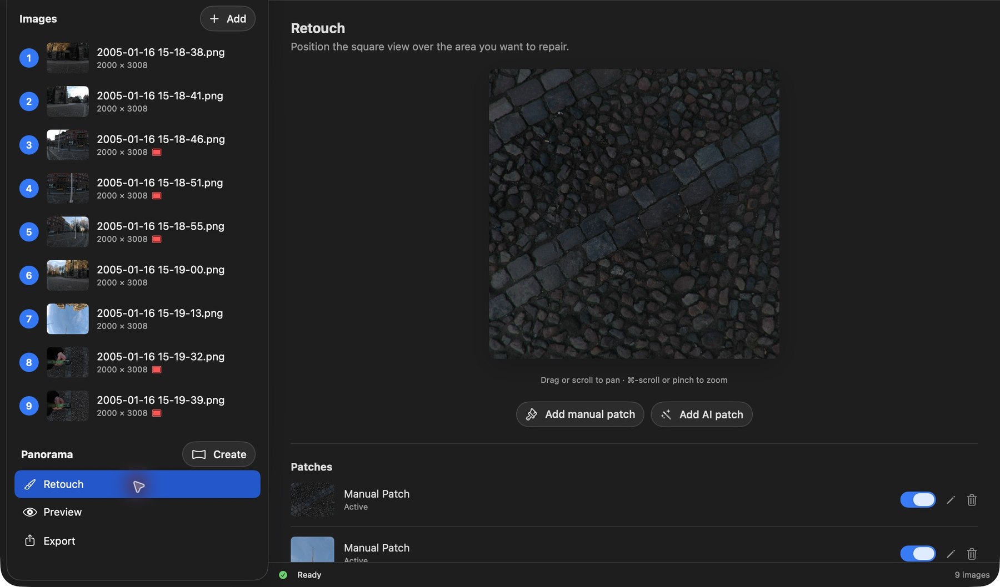

# PanoWizard — Create Complete 360° Panoramas

PanoWizard turns a single ring of overlapping source photos into a complete 360° × 180° panorama. The basic workflow is simple: add the photos, create the panorama, inspect and correct only if needed, then export the finished result.

*A finished panorama created from one sequence of source images.*

**Source images → Create → Inspect and correct if needed → Export**

## Getting started

### 1. Add the source images

Choose **Create Your Panorama** on the welcome screen and select the full image sequence. To add more images to an open project, click **Add** in the sidebar. The photographs should cover one complete turn around the camera with enough overlap between neighboring images.

Select any image in the sidebar to inspect it. Most sequences can be stitched as they are. When necessary, the **Exclude** and **Include** brushes let you tell PanoWizard which source-image areas to avoid or prefer.

### 2. Create the panorama

Click **Create** beside **Panorama**. PanoWizard assembles the overlapping photographs into a complete panorama. This can take a few minutes for a full-resolution sequence.

### 3. Inspect the result

PanoWizard opens **Preview** when stitching is complete. Move around the panorama and inspect the horizon, seams, moving subjects, and the top and bottom of the sphere. The status line confirms the coverage of the finished panorama.

Use **Adjustments** for final global image corrections when needed.

### 4. Correct only what needs correction

If a stitching seam uses the wrong source pixels, return to that source image, paint a small **Exclude** or **Include** mask, and create the panorama again.

**Changing source masks clears the panorama, retouch patches, and global adjustments.** Finish mask corrections before retouching or making final adjustments.

For a localized blemish in an otherwise good panorama, open **Retouch**, position the square view over the area, and add a manual or AI patch. Patches are stored separately and do not change the source images or panorama geometry.

### 5. Export the finished panorama

Open **Export** and choose the result you need:

- **Save JPEG…** for a compact finished image.
- **Save PNG…** for a lossless panorama.
- **Save HTML…** for a self-contained interactive 360° viewer.

Keep **Size: Original** when you want the full stitched resolution. The standard image export is equirectangular at a 2:1 aspect ratio.

## How Do I?

- [Mask source images](HowTo/Masking/index.html) — exclude unwanted pixels and prioritize the best overlapping content.
- [Create a Little Planet](HowTo/LittlePlanet/index.html) — turn the finished panorama into a square Little Planet image.
- [Create a manual patch](HowTo/ManualPatch/index.html) — repair a local area in an external image editor.
- [Create an AI patch](HowTo/AIPatch/index.html) — mask an unwanted object and let AI reconstruct the missing area.

[Back to PanoWizard Help](index.html)
