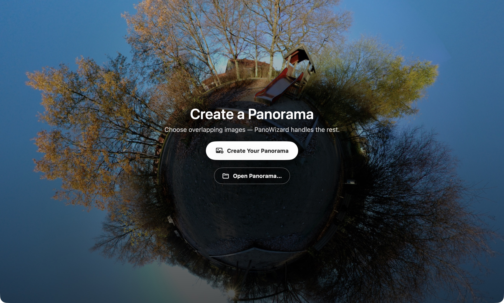

# PanoWizard — Create Complete 360° Panoramas

**Import → Create → Preview → Export**

Start with one complete ring of overlapping fisheye photographs. See [Adding Source Images](source-images.html) if you are unsure which photos to use.

## 1. Import

On the welcome screen, click **Create Your Panorama**, select the photographs together, and click **Choose Images**. This loads the images; it does not stitch them yet.

## 2. Create

Click **Create** beside **Panorama** in the sidebar. Wait while PanoWizard aligns and stitches the images.

## 3. Preview

**Preview** opens when creation finishes. Drag to look around. Hold Command while scrolling, or pinch, to zoom. Check the seams, horizon, sky, and ground.

## 4. Export

Select **Export**, then **Save JPEG…** for an image or **Save HTML…** for an interactive panorama you can open in a browser. **Size: Original** keeps the panorama's existing dimensions.

Save the editable project with **File → Save** (Command-S) if you want to return to it later. Exporting an image does not save the project.

## Next steps

- [Inspect and adjust the result](preview.html).
- [Mask source images](HowTo/Masking/index.html).
- [Create a manual patch](HowTo/ManualPatch/index.html).
- [Create an AI patch](HowTo/AIPatch/index.html).
- [Create a Little Planet](HowTo/LittlePlanet/index.html).

[Back to PanoWizard Help](index.html)
