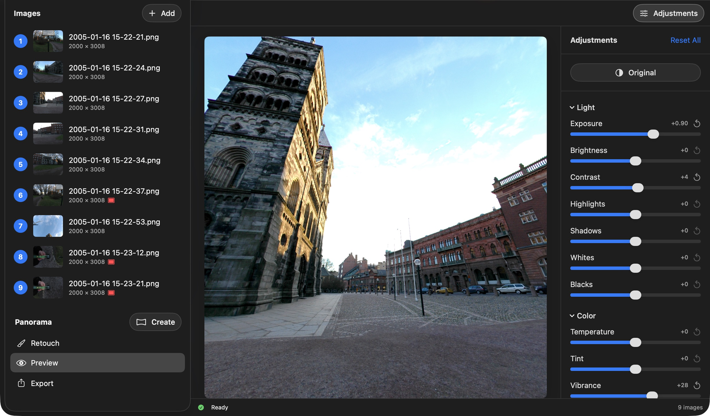
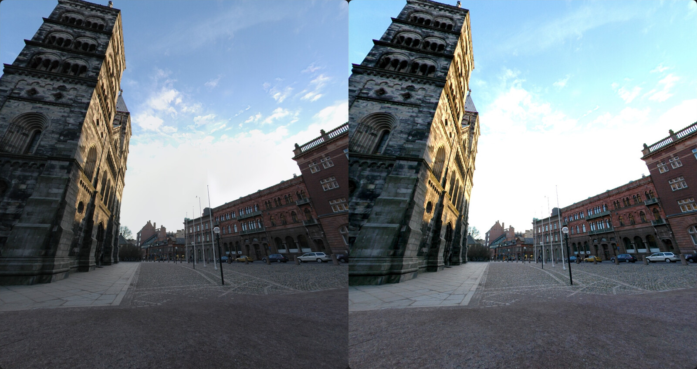

# Preview and Navigation

Drag or scroll to pan. Hold Command while scrolling, or pinch, to zoom. **View → Zoom In**, **Zoom Out**, and **Reset View** are also available (Command-Plus, Command-Minus, Command-0).

Look all the way around, then up at the sky or ceiling (**zenith**) and down at the ground (**nadir**). Check seams, straight lines, moving subjects, and missing coverage. A stretched flat export is normal; Preview shows the image as a sphere.

## Choose the right correction

| What needs fixing? | Use |
| --- | --- |
| A seam uses unwanted content and another source has clean pixels | [Source masks](HowTo/Masking/index.html), then Create again |
| A small blemish in an otherwise good panorama | [Manual](HowTo/ManualPatch/index.html) or [AI](HowTo/AIPatch/index.html) retouch |
| Overall brightness or color | **Adjustments** |

## Adjustments

Click **Adjustments** in Preview. Use **Light** for exposure and tone, and **Color** for white balance and saturation. **Original** temporarily shows the panorama without these adjustments; it does not remove patches. Use a slider's reset arrow or **Reset All** to undo adjustments.

*Left: Original. Right: adjusted. Direction and zoom are unchanged.*

Adjustments are saved with the project and included in exports. They do not repair alignment or seams.

[Back to PanoWizard Help](index.html)
