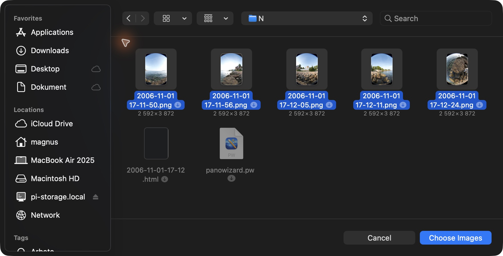

# Adding Source Images

For a new project, **Create Your Panorama** on the welcome screen opens **Choose Source Images**. Select the photographs together and click **Choose Images**. In an open project, click **Add** in the sidebar or choose **Images → Add...**.

## Which photographs?

PanoWizard's supported workflow is one horizontal ring of overlapping fisheye photographs covering a full 360° turn, with enough vertical coverage for the sphere. Repair images can supplement that ring; they are not additional panorama rows.

**Requirements:** Create needs at least two enabled images. All enabled images must have identical pixel dimensions after rotation. Two images alone do not guarantee enough overlap or full coverage. Files must be readable as images; after adding files to an open project, check the status line for any that could not be read.

**Photography advice:** keep the camera near the same position as you turn, use generous overlap, and keep exposure and white balance consistent. Moving subjects and nearby objects can make seams harder to hide. These are recommendations, not checks performed by the importer.

## Inspect the images

Click an image's thumbnail or filename to inspect it. PanoWizard arranges imported images automatically. **Rotate** turns the selected image 90° counterclockwise without modifying its source file.

The **numbered circle** enables or disables an image for stitching. A disabled image remains in the project. The small mask symbol indicates a source mask; the repair symbol identifies a Repair Image.

Leave **Image Type → Automatic** selected unless you need to override the role. Right-click a sidebar image to choose **Panorama Ring** or **Repair Image**. Repair images fill local coverage without steering the ring's geometry; they cannot bridge missing overlap between ring images.

**Remove Image…** offers **Remove from Project** or **Move Source File to Trash**. The latter also removes the original photograph from its folder.

**Source changes clear the panorama, retouch patches, and adjustments.** This includes adding, removing, enabling/disabling, rotating, changing image roles, and editing masks. Save a separate project with **File → Save As…** before experimenting with a finished result.

Next: [Creating the Panorama](creating-panorama.html).

[Back to PanoWizard Help](index.html)
